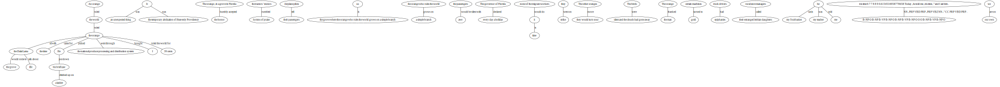

### Installations, if needed


```python
!pip install spacy==2.0.13 # Above 2.0.13 doesn't work with the neuralcoref resolution
!pip install https://github.com/huggingface/neuralcoref-models/releases/download/en_coref_md-3.0.0/en_coref_md-3.0.0.tar.gz # This is the coref language model
!pip install networkx
!pip install pydot # To draw our graphs in graphviz
!pip install graphviz
```

    Requirement already satisfied: spacy==2.0.13 in /anaconda/envs/ear/lib/python3.6/site-packages (2.0.13)
    Requirement already satisfied: msgpack-numpy<0.29,<0.4.4.0murmurhash>=0.28 in /anaconda/envs/ear/lib/python3.6/site-packages (from spacy==2.0.13) (0.4.3.2)
    Requirement already satisfied: dill<0.3,>=0.2 in /anaconda/envs/ear/lib/python3.6/site-packages (from spacy==2.0.13) (0.2.8.2)
    Requirement already satisfied: thinc<6.11.0,>=6.10.3 in /anaconda/envs/ear/lib/python3.6/site-packages (from spacy==2.0.13) (6.10.3)
    Requirement already satisfied: cymem<1.32,>=1.30 in /anaconda/envs/ear/lib/python3.6/site-packages (from spacy==2.0.13) (1.31.2)
    Requirement already satisfied: ujson>=1.35 in /anaconda/envs/ear/lib/python3.6/site-packages (from spacy==2.0.13) (1.35)
    Requirement already satisfied: plac<1.0.0,>=0.9.6 in /anaconda/envs/ear/lib/python3.6/site-packages (from spacy==2.0.13) (0.9.6)
    Requirement already satisfied: regex==2018.01.10 in /anaconda/envs/ear/lib/python3.6/site-packages (from spacy==2.0.13) (2018.1.10)
    Requirement already satisfied: requests<3.0.0,>=2.13.0 in /anaconda/envs/ear/lib/python3.6/site-packages (from spacy==2.0.13) (2.18.4)
    Requirement already satisfied: numpy>=1.15.0 in /anaconda/envs/ear/lib/python3.6/site-packages (from spacy==2.0.13) (1.15.4)
    Requirement already satisfied: preshed<2.0.0,>=1.0.0 in /anaconda/envs/ear/lib/python3.6/site-packages (from spacy==2.0.13) (1.0.1)
    Requirement already satisfied: msgpack>=0.3.0 in /anaconda/envs/ear/lib/python3.6/site-packages (from msgpack-numpy<0.29,<0.4.4.0murmurhash>=0.28->spacy==2.0.13) (0.5.6)
    Requirement already satisfied: cytoolz<0.10,>=0.9.0 in /anaconda/envs/ear/lib/python3.6/site-packages (from thinc<6.11.0,>=6.10.3->spacy==2.0.13) (0.9.0.1)
    Requirement already satisfied: wrapt<1.11.0,>=1.10.0 in /anaconda/envs/ear/lib/python3.6/site-packages (from thinc<6.11.0,>=6.10.3->spacy==2.0.13) (1.10.11)
    Requirement already satisfied: tqdm<5.0.0,>=4.10.0 in /anaconda/envs/ear/lib/python3.6/site-packages (from thinc<6.11.0,>=6.10.3->spacy==2.0.13) (4.28.1)
    Requirement already satisfied: murmurhash<0.29.0,>=0.28.0 in /anaconda/envs/ear/lib/python3.6/site-packages (from thinc<6.11.0,>=6.10.3->spacy==2.0.13) (0.28.0)
    Requirement already satisfied: six<2.0.0,>=1.10.0 in /anaconda/envs/ear/lib/python3.6/site-packages (from thinc<6.11.0,>=6.10.3->spacy==2.0.13) (1.11.0)
    Requirement already satisfied: chardet<3.1.0,>=3.0.2 in /anaconda/envs/ear/lib/python3.6/site-packages (from requests<3.0.0,>=2.13.0->spacy==2.0.13) (3.0.4)
    Requirement already satisfied: idna<2.7,>=2.5 in /anaconda/envs/ear/lib/python3.6/site-packages (from requests<3.0.0,>=2.13.0->spacy==2.0.13) (2.6)
    Requirement already satisfied: urllib3<1.23,>=1.21.1 in /anaconda/envs/ear/lib/python3.6/site-packages (from requests<3.0.0,>=2.13.0->spacy==2.0.13) (1.22)
    Requirement already satisfied: certifi>=2017.4.17 in /anaconda/envs/ear/lib/python3.6/site-packages (from requests<3.0.0,>=2.13.0->spacy==2.0.13) (2018.4.16)
    Requirement already satisfied: toolz>=0.8.0 in /anaconda/envs/ear/lib/python3.6/site-packages (from cytoolz<0.10,>=0.9.0->thinc<6.11.0,>=6.10.3->spacy==2.0.13) (0.9.0)
    Collecting https://github.com/huggingface/neuralcoref-models/releases/download/en_coref_md-3.0.0/en_coref_md-3.0.0.tar.gz
    [?25l  Downloading https://github.com/huggingface/neuralcoref-models/releases/download/en_coref_md-3.0.0/en_coref_md-3.0.0.tar.gz (161.3MB)
        100% |████████████████████████████████| 161.3MB 227kB/s ta 0:00:011
    [?25hRequirement already satisfied (use --upgrade to upgrade): en-coref-md==3.0.0 from https://github.com/huggingface/neuralcoref-models/releases/download/en_coref_md-3.0.0/en_coref_md-3.0.0.tar.gz in /anaconda/envs/ear/lib/python3.6/site-packages
    Requirement already satisfied: pip in /anaconda/envs/ear/lib/python3.6/site-packages (18.1)
    Collecting install
      Could not find a version that satisfies the requirement install (from versions: )
    No matching distribution found for install
    Requirement already satisfied: networkx in /anaconda/envs/ear/lib/python3.6/site-packages (2.1)
    Requirement already satisfied: decorator>=4.1.0 in /anaconda/envs/ear/lib/python3.6/site-packages (from networkx) (4.3.0)
    Requirement already satisfied: pydot in /anaconda/envs/ear/lib/python3.6/site-packages (1.2.4)
    Requirement already satisfied: pyparsing>=2.1.4 in /anaconda/envs/ear/lib/python3.6/site-packages (from pydot) (2.2.0)
    Requirement already satisfied: graphviz in /anaconda/envs/ear/lib/python3.6/site-packages (0.10.1)


### Imports & Loading Files


```python
import spacy
from spacy import displacy
from collections import Counter
import re
import os
import pandas as pd
import networkx as nx
import sys
import pydot
import matplotlib.pyplot as plt
import graphviz

TEXT_FILENAME = 'TheOrange.txt'

with open(TEXT_FILENAME, 'rb') as raw_text:
    text = raw_text.read().strip().decode('utf-8',errors='replace')
```

### Cleaning text


```python
# Can uncomment the below if Harry Potter & removing title.
#text = text[39:]

cleaned_text = re.sub(r'(?:[A-Z]{2,}\s+)','',text).strip()
cleaned_text=re.sub(r'\s+',' ',cleaned_text)

# Can uncomment if lowercase is desired
#cleaned_text = text.lower()
```

### Loading and running SpaCy English Medium-Sized Pipeline


```python
# Download the english medium-sized pipeline
! python -m spacy download en_core_web_md
```

    Requirement already satisfied: en_core_web_md==2.0.0 from https://github.com/explosion/spacy-models/releases/download/en_core_web_md-2.0.0/en_core_web_md-2.0.0.tar.gz#egg=en_core_web_md==2.0.0 in /anaconda/envs/ear/lib/python3.6/site-packages (2.0.0)
    
        Linking successful
        /anaconda/envs/ear/lib/python3.6/site-packages/en_core_web_md -->
        /anaconda/envs/ear/lib/python3.6/site-packages/spacy/data/en_core_web_md
    
        You can now load the model via spacy.load('en_core_web_md')
    


```python
# Use that file to process the text into a doc.
nlp = spacy.load('en_core_web_md')
doc = nlp(cleaned_text)
```

### Viewing named entities


```python
displacy.render(doc, jupyter=True, style='ent')
```


<div class="entities" style="line-height: 2.5">An orange ruled the world. It was an unexpected thing, the temporary abdication of Heavenly Providence, entrusting the whole matter to a simple orange. The orange, in a grove in 
<mark class="entity" style="background: #feca74; padding: 0.45em 0.6em; margin: 0 0.25em; line-height: 1; border-radius: 0.35em; box-decoration-break: clone; -webkit-box-decoration-break: clone">
    Florida
    <span style="font-size: 0.8em; font-weight: bold; line-height: 1; border-radius: 0.35em; text-transform: uppercase; vertical-align: middle; margin-left: 0.5rem">GPE</span>
</mark>
, humbly accepted the honor. The other oranges, the birds, and the men in their tractors wept with joy; the tractors' motors rumbled hymns of praise. Airplane pilots passing over would circle the grove and tell their passengers, "Below us is the grove where the orange who rules the world grows on a simple branch." And the passengers would be silent with awe. The governor of 
<mark class="entity" style="background: #feca74; padding: 0.45em 0.6em; margin: 0 0.25em; line-height: 1; border-radius: 0.35em; box-decoration-break: clone; -webkit-box-decoration-break: clone">
    Florida
    <span style="font-size: 0.8em; font-weight: bold; line-height: 1; border-radius: 0.35em; text-transform: uppercase; vertical-align: middle; margin-left: 0.5rem">GPE</span>
</mark>
 declared 
<mark class="entity" style="background: #bfe1d9; padding: 0.45em 0.6em; margin: 0 0.25em; line-height: 1; border-radius: 0.35em; box-decoration-break: clone; -webkit-box-decoration-break: clone">
    every day
    <span style="font-size: 0.8em; font-weight: bold; line-height: 1; border-radius: 0.35em; text-transform: uppercase; vertical-align: middle; margin-left: 0.5rem">DATE</span>
</mark>
 a holiday. On 
<mark class="entity" style="background: #bfe1d9; padding: 0.45em 0.6em; margin: 0 0.25em; line-height: 1; border-radius: 0.35em; box-decoration-break: clone; -webkit-box-decoration-break: clone">
    summer afternoons
    <span style="font-size: 0.8em; font-weight: bold; line-height: 1; border-radius: 0.35em; text-transform: uppercase; vertical-align: middle; margin-left: 0.5rem">TIME</span>
</mark>
 the Dalai Lama would come to the grove and sit with the orange, and talk about life. When the time came for the orange to be picked, none of the migrant workers would do it: they went on strike. The foremen wept. The other oranges swore they would turn sour. But the orange who ruled the world said, "No, my friends; it is time." Finally a man from 
<mark class="entity" style="background: #feca74; padding: 0.45em 0.6em; margin: 0 0.25em; line-height: 1; border-radius: 0.35em; box-decoration-break: clone; -webkit-box-decoration-break: clone">
    Chicago
    <span style="font-size: 0.8em; font-weight: bold; line-height: 1; border-radius: 0.35em; text-transform: uppercase; vertical-align: middle; margin-left: 0.5rem">GPE</span>
</mark>
, with a heart as windy and cold as 
<mark class="entity" style="background: #ff9561; padding: 0.45em 0.6em; margin: 0 0.25em; line-height: 1; border-radius: 0.35em; box-decoration-break: clone; -webkit-box-decoration-break: clone">
    Lake Michigan
    <span style="font-size: 0.8em; font-weight: bold; line-height: 1; border-radius: 0.35em; text-transform: uppercase; vertical-align: middle; margin-left: 0.5rem">LOC</span>
</mark>
 in wintertime, was brought in. He put down his briefcase, climbed up on a ladder, and picked the orange. The birds were silent and the clouds had gone away. The orange thanked the man from 
<mark class="entity" style="background: #feca74; padding: 0.45em 0.6em; margin: 0 0.25em; line-height: 1; border-radius: 0.35em; box-decoration-break: clone; -webkit-box-decoration-break: clone">
    Chicago
    <span style="font-size: 0.8em; font-weight: bold; line-height: 1; border-radius: 0.35em; text-transform: uppercase; vertical-align: middle; margin-left: 0.5rem">GPE</span>
</mark>
. They say that when the orange went through the national produce processing and distribution system, certain machines turned to gold, truck drivers had epiphanies, aging rural store managers called their estranged lesbian daughters on Wall Street and all was forgiven. I bought the orange who ruled the world for 
<mark class="entity" style="background: #e4e7d2; padding: 0.45em 0.6em; margin: 0 0.25em; line-height: 1; border-radius: 0.35em; box-decoration-break: clone; -webkit-box-decoration-break: clone">
    39 cents
    <span style="font-size: 0.8em; font-weight: bold; line-height: 1; border-radius: 0.35em; text-transform: uppercase; vertical-align: middle; margin-left: 0.5rem">MONEY</span>
</mark>
 at 
<mark class="entity" style="background: #7aecec; padding: 0.45em 0.6em; margin: 0 0.25em; line-height: 1; border-radius: 0.35em; box-decoration-break: clone; -webkit-box-decoration-break: clone">
    Safeway
    <span style="font-size: 0.8em; font-weight: bold; line-height: 1; border-radius: 0.35em; text-transform: uppercase; vertical-align: middle; margin-left: 0.5rem">ORG</span>
</mark>
 
<mark class="entity" style="background: #bfe1d9; padding: 0.45em 0.6em; margin: 0 0.25em; line-height: 1; border-radius: 0.35em; box-decoration-break: clone; -webkit-box-decoration-break: clone">
    three days ago
    <span style="font-size: 0.8em; font-weight: bold; line-height: 1; border-radius: 0.35em; text-transform: uppercase; vertical-align: middle; margin-left: 0.5rem">DATE</span>
</mark>
, and for 
<mark class="entity" style="background: #bfe1d9; padding: 0.45em 0.6em; margin: 0 0.25em; line-height: 1; border-radius: 0.35em; box-decoration-break: clone; -webkit-box-decoration-break: clone">
    three days
    <span style="font-size: 0.8em; font-weight: bold; line-height: 1; border-radius: 0.35em; text-transform: uppercase; vertical-align: middle; margin-left: 0.5rem">DATE</span>
</mark>
 he sat in my fruit basket and was my teacher. 
<mark class="entity" style="background: #bfe1d9; padding: 0.45em 0.6em; margin: 0 0.25em; line-height: 1; border-radius: 0.35em; box-decoration-break: clone; -webkit-box-decoration-break: clone">
    Today
    <span style="font-size: 0.8em; font-weight: bold; line-height: 1; border-radius: 0.35em; text-transform: uppercase; vertical-align: middle; margin-left: 0.5rem">DATE</span>
</mark>
, he told me, "it is time," and I ate him. Now we are on our own again.</div>


### Viewing dependencies


```python
sentence_spans = list(doc.sents)
displacy.render(sentence_spans[0], jupyter=True, style='dep')
```


<svg xmlns="http://www.w3.org/2000/svg" xmlns:xlink="http://www.w3.org/1999/xlink" id="0" class="displacy" width="925" height="312.0" style="max-width: none; height: 312.0px; color: #000000; background: #ffffff; font-family: Arial">
<text class="displacy-token" fill="currentColor" text-anchor="middle" y="222.0">
    <tspan class="displacy-word" fill="currentColor" x="50">An</tspan>
    <tspan class="displacy-tag" dy="2em" fill="currentColor" x="50">DET</tspan>
</text>

<text class="displacy-token" fill="currentColor" text-anchor="middle" y="222.0">
    <tspan class="displacy-word" fill="currentColor" x="225">orange</tspan>
    <tspan class="displacy-tag" dy="2em" fill="currentColor" x="225">NOUN</tspan>
</text>

<text class="displacy-token" fill="currentColor" text-anchor="middle" y="222.0">
    <tspan class="displacy-word" fill="currentColor" x="400">ruled</tspan>
    <tspan class="displacy-tag" dy="2em" fill="currentColor" x="400">VERB</tspan>
</text>

<text class="displacy-token" fill="currentColor" text-anchor="middle" y="222.0">
    <tspan class="displacy-word" fill="currentColor" x="575">the</tspan>
    <tspan class="displacy-tag" dy="2em" fill="currentColor" x="575">DET</tspan>
</text>

<text class="displacy-token" fill="currentColor" text-anchor="middle" y="222.0">
    <tspan class="displacy-word" fill="currentColor" x="750">world.</tspan>
    <tspan class="displacy-tag" dy="2em" fill="currentColor" x="750">NOUN</tspan>
</text>

<g class="displacy-arrow">
    <path class="displacy-arc" id="arrow-0-0" stroke-width="2px" d="M70,177.0 C70,89.5 220.0,89.5 220.0,177.0" fill="none" stroke="currentColor"/>
    <text dy="1.25em" style="font-size: 0.8em; letter-spacing: 1px">
        <textPath xlink:href="#arrow-0-0" class="displacy-label" startOffset="50%" fill="currentColor" text-anchor="middle">det</textPath>
    </text>
    <path class="displacy-arrowhead" d="M70,179.0 L62,167.0 78,167.0" fill="currentColor"/>
</g>

<g class="displacy-arrow">
    <path class="displacy-arc" id="arrow-0-1" stroke-width="2px" d="M245,177.0 C245,89.5 395.0,89.5 395.0,177.0" fill="none" stroke="currentColor"/>
    <text dy="1.25em" style="font-size: 0.8em; letter-spacing: 1px">
        <textPath xlink:href="#arrow-0-1" class="displacy-label" startOffset="50%" fill="currentColor" text-anchor="middle">nsubj</textPath>
    </text>
    <path class="displacy-arrowhead" d="M245,179.0 L237,167.0 253,167.0" fill="currentColor"/>
</g>

<g class="displacy-arrow">
    <path class="displacy-arc" id="arrow-0-2" stroke-width="2px" d="M595,177.0 C595,89.5 745.0,89.5 745.0,177.0" fill="none" stroke="currentColor"/>
    <text dy="1.25em" style="font-size: 0.8em; letter-spacing: 1px">
        <textPath xlink:href="#arrow-0-2" class="displacy-label" startOffset="50%" fill="currentColor" text-anchor="middle">det</textPath>
    </text>
    <path class="displacy-arrowhead" d="M595,179.0 L587,167.0 603,167.0" fill="currentColor"/>
</g>

<g class="displacy-arrow">
    <path class="displacy-arc" id="arrow-0-3" stroke-width="2px" d="M420,177.0 C420,2.0 750.0,2.0 750.0,177.0" fill="none" stroke="currentColor"/>
    <text dy="1.25em" style="font-size: 0.8em; letter-spacing: 1px">
        <textPath xlink:href="#arrow-0-3" class="displacy-label" startOffset="50%" fill="currentColor" text-anchor="middle">dobj</textPath>
    </text>
    <path class="displacy-arrowhead" d="M750.0,179.0 L758.0,167.0 742.0,167.0" fill="currentColor"/>
</g>
</svg>


### Extracting Triples with ReVerb
From http://reverb.cs.washington.edu/ (and used in the paper "Information retrieval in folktales using natural
language processing": https://arxiv.org/pdf/1511.03012.pdf)


```python
# Preparing the filename for the tab-separated values output of ReVerb
tsv_filename = TEXT_FILENAME.split('.')[0] + "_ReVerb.tsv"

# Run the Java package. Java JDK is required to be installed from
# https://www.oracle.com/technetwork/java/javase/downloads/jdk11-downloads-5066655.html
os.system("java -Xmx512m -jar reverb-latest.jar -a {0} > {1}".format(TEXT_FILENAME, tsv_filename))

# Reading the results from the Java executable into a Pandas dataframe.
reverb_results = pd.read_csv(tsv_filename, header=None, sep='\t')
reverb_results.columns = ['filename','Sentence_Num','Arg1','Rel','Arg2','Arg1_StartInd','Arg1_EndInd','Rel_StartInd','Rel_EndInd', 'Arg2_StartInd','Arg2_EndInd', 'Confidence','Sent_Text', 'Sent_POS','Sent_ChunkTags', 'Arg1_Norm', 'Rel_Norm', 'Arg2_Norm']

# Set the option to not truncate the text in longer cells
pd.set_option('display.max_colwidth', -1)
```


```python
# Exploring the dataframe
reverb_results.head()
```


<div>
<style scoped>
    .dataframe tbody tr th:only-of-type {
        vertical-align: middle;
    }

    .dataframe tbody tr th {
        vertical-align: top;
    }

    .dataframe thead th {
        text-align: right;
    }
</style>
<table border="1" class="dataframe">
  <thead>
    <tr style="text-align: right;">
      <th></th>
      <th>filename</th>
      <th>Sentence_Num</th>
      <th>Arg1</th>
      <th>Rel</th>
      <th>Arg2</th>
      <th>Arg1_StartInd</th>
      <th>Arg1_EndInd</th>
      <th>Rel_StartInd</th>
      <th>Rel_EndInd</th>
      <th>Arg2_StartInd</th>
      <th>Arg2_EndInd</th>
      <th>Confidence</th>
      <th>Sent_Text</th>
      <th>Sent_POS</th>
      <th>Sent_ChunkTags</th>
      <th>Arg1_Norm</th>
      <th>Rel_Norm</th>
      <th>Arg2_Norm</th>
    </tr>
  </thead>
  <tbody>
    <tr>
      <th>0</th>
      <td>/Users/andrewlarimer/Dropbox/Berkeley/W266_NLP/FinalProject/TheOrange.txt</td>
      <td>1</td>
      <td>An orange</td>
      <td>ruled</td>
      <td>the world</td>
      <td>0</td>
      <td>2</td>
      <td>2</td>
      <td>3</td>
      <td>3</td>
      <td>5</td>
      <td>0.884226</td>
      <td>An orange ruled the world .</td>
      <td>DT NN VBD DT NN .</td>
      <td>B-NP I-NP B-VP B-NP I-NP O</td>
      <td>an orange</td>
      <td>rule</td>
      <td>the world</td>
    </tr>
    <tr>
      <th>1</th>
      <td>/Users/andrewlarimer/Dropbox/Berkeley/W266_NLP/FinalProject/TheOrange.txt</td>
      <td>2</td>
      <td>It</td>
      <td>was</td>
      <td>an unexpected thing</td>
      <td>0</td>
      <td>1</td>
      <td>1</td>
      <td>2</td>
      <td>2</td>
      <td>5</td>
      <td>0.721638</td>
      <td>It was an unexpected thing , the temporary abdication of Heavenly Providence , entrusting the whole matter to a simple orange .</td>
      <td>PRP VBD DT JJ NN , DT JJ NN IN NNP NNP , VBG DT JJ NN TO DT JJ NN .</td>
      <td>B-NP B-VP B-NP I-NP I-NP O B-NP I-NP I-NP I-NP I-NP I-NP O B-VP B-NP I-NP I-NP B-PP B-NP I-NP I-NP O</td>
      <td>it</td>
      <td>be</td>
      <td>an unexpected thing</td>
    </tr>
    <tr>
      <th>2</th>
      <td>/Users/andrewlarimer/Dropbox/Berkeley/W266_NLP/FinalProject/TheOrange.txt</td>
      <td>2</td>
      <td>It</td>
      <td>was</td>
      <td>the temporary abdication of Heavenly Providence</td>
      <td>0</td>
      <td>1</td>
      <td>1</td>
      <td>2</td>
      <td>6</td>
      <td>12</td>
      <td>0.721216</td>
      <td>It was an unexpected thing , the temporary abdication of Heavenly Providence , entrusting the whole matter to a simple orange .</td>
      <td>PRP VBD DT JJ NN , DT JJ NN IN NNP NNP , VBG DT JJ NN TO DT JJ NN .</td>
      <td>B-NP B-VP B-NP I-NP I-NP O B-NP I-NP I-NP I-NP I-NP I-NP O B-VP B-NP I-NP I-NP B-PP B-NP I-NP I-NP O</td>
      <td>it</td>
      <td>be</td>
      <td>the temporary abdication of heavenly providence</td>
    </tr>
    <tr>
      <th>3</th>
      <td>/Users/andrewlarimer/Dropbox/Berkeley/W266_NLP/FinalProject/TheOrange.txt</td>
      <td>3</td>
      <td>The orange , in a grove in Florida</td>
      <td>humbly accepted</td>
      <td>the honor</td>
      <td>0</td>
      <td>8</td>
      <td>9</td>
      <td>11</td>
      <td>11</td>
      <td>13</td>
      <td>0.333979</td>
      <td>The orange , in a grove in Florida , humbly accepted the honor .</td>
      <td>DT NN , IN DT NN IN NNP , RB VBD DT NN .</td>
      <td>B-NP I-NP O B-PP B-NP I-NP B-PP B-NP O B-VP I-VP B-NP I-NP O</td>
      <td>the orange , in a grove in florida</td>
      <td>accept</td>
      <td>the honor</td>
    </tr>
    <tr>
      <th>4</th>
      <td>/Users/andrewlarimer/Dropbox/Berkeley/W266_NLP/FinalProject/TheOrange.txt</td>
      <td>4</td>
      <td>the tractors ' motors</td>
      <td>rumbled</td>
      <td>hymns of praise</td>
      <td>17</td>
      <td>21</td>
      <td>21</td>
      <td>22</td>
      <td>22</td>
      <td>25</td>
      <td>0.602737</td>
      <td>The other oranges , the birds , and the men in their tractors wept with joy ; the tractors ' motors rumbled hymns of praise .</td>
      <td>DT JJ NNS , DT NNS , CC DT NNS IN PRP$ NNS VBN IN NN : DT NNS POS NNS VBD NNS IN NN .</td>
      <td>B-NP I-NP I-NP O B-NP I-NP O O B-NP I-NP B-PP B-NP I-NP B-VP B-PP B-NP O B-NP I-NP I-NP I-NP B-VP B-NP I-NP I-NP O</td>
      <td>the tractors ' motors</td>
      <td>rumble</td>
      <td>hymns of praise</td>
    </tr>
  </tbody>
</table>
</div>


### Graphing

#### Converting triples to graph nodes and edges


```python
def create_nodes_and_edge(row):
    G.add_node(row['Arg1'])
    G.add_node(row['Arg2'])
    G.add_edge(row['Arg1'], row['Arg2'], label=row['Rel'])
```


```python
# Establish our graph using Networkx
G = nx.Graph()
_ = reverb_results.apply(lambda x: create_nodes_and_edge(x), axis=1)
```


```python
# Write our graph to DOT format to be read and visualized by GraphViz
nx.drawing.nx_pydot.write_dot(G,'graph_dot.txt')
```

#### Draw the graph


```python
from graphviz import Source

graph_filename = TEXT_FILENAME.split('.')[0] + '_Graph'

# Load the saved DOT format
graph_visualized = Source.from_file('graph_dot.txt')

# Save it to a png
graph_visualized.render(filename=graph_filename, format='png')

# View it in the notebook
graph_visualized
```





### Coreference Resolution

Using the NeuralCoref library: https://github.com/huggingface/neuralcoref
(If I can ever get it to work, which so far I cannot.)


```python
nlp_coref = spacy.load('en_coref_sm')
doc = nlp_coref(cleaned_text)
```


```python
doc._.has_coref
doc._.coref_clusters
```
